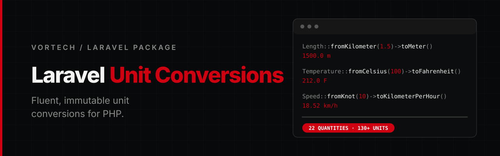

<p align="center">
  
</p>

<p align="center">
  <a href="https://github.com/Vortech-Group/unit-conversions/actions/workflows/tests.yml"></a>
  <a href="https://packagist.org/packages/vortech/laravel-unit-conversions"></a>
  <a href="https://packagist.org/packages/vortech/laravel-unit-conversions"></a>
  <a href="https://packagist.org/packages/vortech/laravel-unit-conversions"></a>
  
  <a href="LICENSE.md"></a>
</p>

<p align="center">
  Fluent, immutable unit conversions for Laravel.<br>
  Mass, length, capacity, area, time, speed, energy, power, pressure and more, with no surprises.
</p>

---

## Requirements

- PHP 8.4+
- Laravel 13

## Installation

```bash
composer require vortech/laravel-unit-conversions
```

## Usage

Start from a quantity with a `from*` method, then convert with a `to*` method. A conversion returns a new, immutable quantity of the same kind, so you can keep converting.

```php
use Vortech\UnitConversions\Length;
use Vortech\UnitConversions\Mass;

$meters = Length::fromKilometer(1.5)->toMeter();
$centimeters = $meters->toCentimeter();

$meters->getValue();      // 1500.0
$meters->getUnit();       // LengthUnit::Meter
$centimeters->getValue(); // 150000.0

Mass::fromGrams(2500)->toKilograms()->getValue(); // 2.5
```

Converting to the unit you started with returns the same value, and the original quantity is never modified.

Every quantity has its own unit enum, so passing the wrong kind of unit, such as `new Mass(1, LengthUnit::Meter)`, is a type error.

### Supported units

| Class         | Units                                                                          | Methods                                       |
|---------------|--------------------------------------------------------------------------------|-----------------------------------------------|
| `Mass`        | milligram, gram, kilogram, ton, ounce, pound                                   | `fromGrams()`, `toPounds()`, ...              |
| `Length`      | millimeter, centimeter, decimeter, meter, kilometer, inch, foot, yard, mile    | `fromMeter()`, `toFoot()`, ...                |
| `Capacity`    | milliliter, centiliter, deciliter, liter, hectoliter, fluid ounce, pint, gallon (US) | `fromLiters()`, `toGallons()`, ...      |
| `Area`        | mm², cm², m², hectare, km², in², ft², acre                                     | `fromSquareMeter()`, `toAcre()`, ...          |
| `Time`        | millisecond, second, minute, hour, day, week                                   | `fromHours()`, `toMinutes()`, ...             |
| `Speed`       | m/s, km/h, mph, knot, ft/s                                                     | `fromKilometerPerHour()`, `toKnot()`, ...     |
| `Temperature` | celsius, fahrenheit, kelvin                                                    | `fromCelsius()`, `toKelvin()`, ...            |
| `Energy` | joule, kilojoule, calorie, kilocalorie, Wh, kWh, BTU | `fromKilowattHour()`, `toJoule()`, ... |
| `Power` | watt, kilowatt, megawatt, metric and mechanical horsepower | `fromKilowatt()`, `toMetricHorsepower()`, ... |
| `Pressure` | pascal, hectopascal, kilopascal, millibar, bar, atmosphere, psi, mmHg | `fromBar()`, `toPascal()`, ... |
| `Force` | newton, kilonewton, dyne, pound-force, kilogram-force | `fromNewton()`, `toPoundForce()`, ... |
| `Angle` | degree, radian, gradian, arcminute, arcsecond, turn | `fromDegree()`, `toRadian()`, ... |
| `Frequency` | hertz, kilohertz, megahertz, gigahertz, rpm | `fromHertz()`, `toRevolutionPerMinute()`, ... |
| `DataSize` | bit, byte, kB/MB/GB/TB (decimal), KiB/MiB/GiB/TiB (binary) | `fromGigabyte()`, `toMebibyte()`, ... |
| `Volume` | mm³, cm³, dm³, m³, in³, ft³, yd³ | `fromCubicMeter()`, `toCubicFoot()`, ... |
| `FlowRate` | l/h, l/min, l/s, m³/h, m³/s, gallon/min, ft³/min | `fromLiterPerMinute()`, `toGallonPerMinute()`, ... |
| `Density` | g/l, kg/m³, g/cm³, kg/l, lb/ft³, lb/in³ | `fromGramPerCubicCentimeter()`, ... |
| `Torque` | N·cm, N·m, kN·m, kgf·m, lbf·ft, lbf·in | `fromNewtonMeter()`, `toPoundForceFoot()`, ... |
| `Acceleration` | m/s², Gal, ft/s², standard gravity | `fromStandardGravity()`, ... |
| `Voltage` | millivolt, volt, kilovolt, megavolt | `fromVolt()`, `toKilovolt()`, ... |
| `ElectricCurrent` | milliampere, ampere, kiloampere | `fromAmpere()`, `toMilliampere()`, ... |
| `Resistance` | milliohm, ohm, kiloohm, megaohm | `fromOhm()`, `toKiloohm()`, ... |

Units are cases of per-quantity enums such as `MassUnit` or `LengthUnit` (in `Vortech\UnitConversions\Enums`), backed by their symbol (`kg`, `cm`, `hl`, `C`, ...). They all implement the `Vortech\UnitConversions\Contracts\Unit` contract.

### Floating point

Values are `float`s, so tiny rounding differences can appear. Round or compare with a tolerance when needed.

## Testing

```bash
composer test
composer analyse
composer format
```

The suite uses [Pest](https://pestphp.com) and requires PHP 8.4+.

## Changelog

See [CHANGELOG](CHANGELOG.md) for what has changed recently.

## Security

If you discover a security issue, please email [mate@vortech.hu](mailto:mate@vortech.hu) instead of using the issue tracker.

## Credits

- Mate Papp, Developer @ Vortech

## License

The MIT License (MIT). See the [License File](LICENSE.md) for more information.

---

<p align="center">
  <a href="https://vortech.hu">
    <picture>
      <source media="(prefers-color-scheme: dark)" srcset="art/logo-white.png">
      
    </picture>
  </a>
</p>
